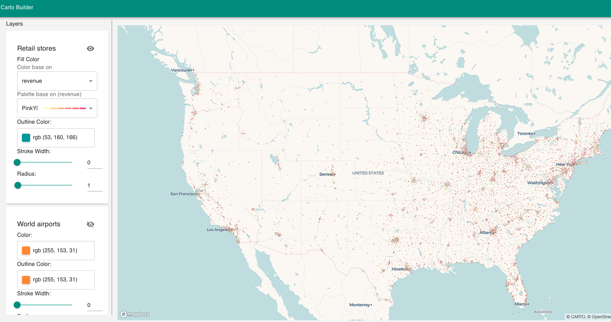
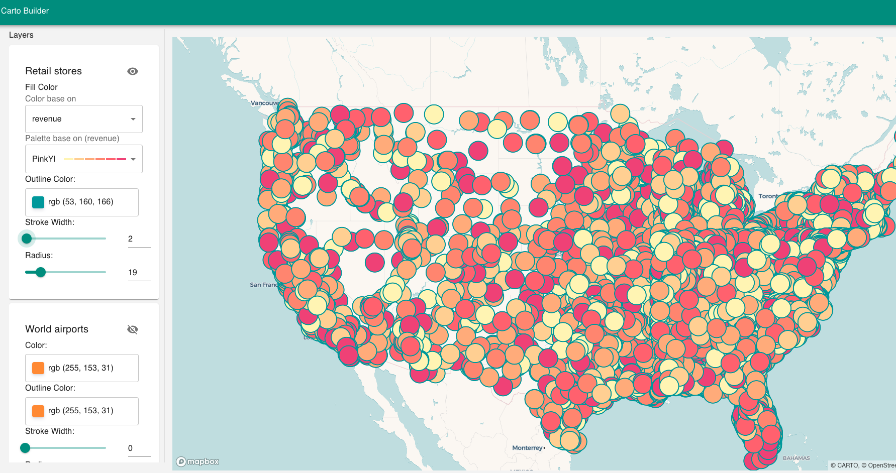
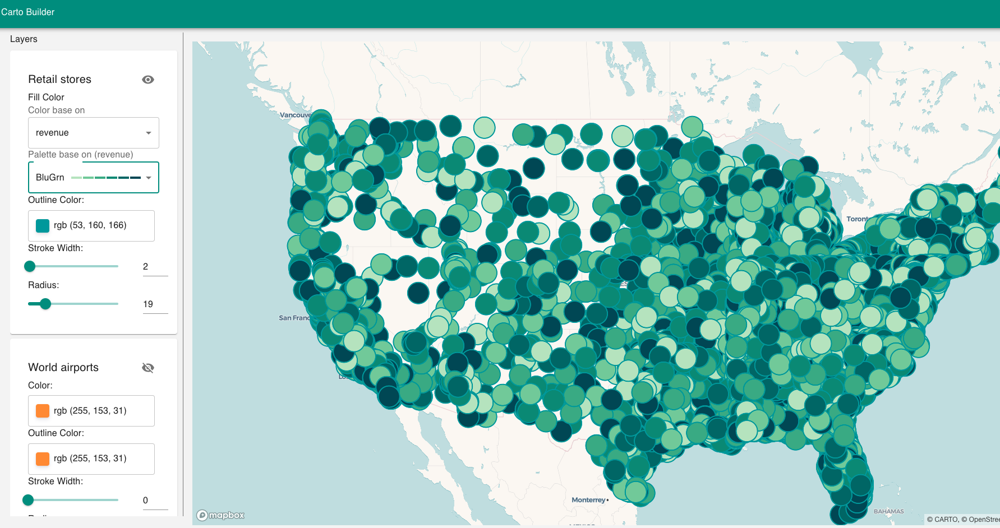
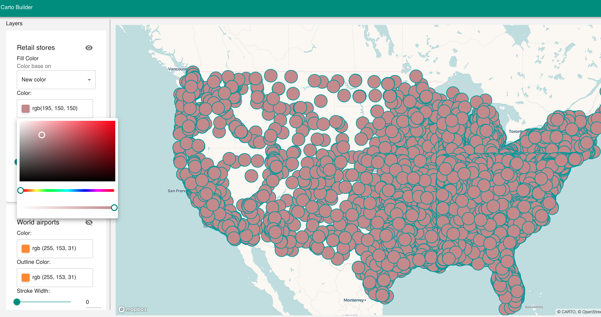
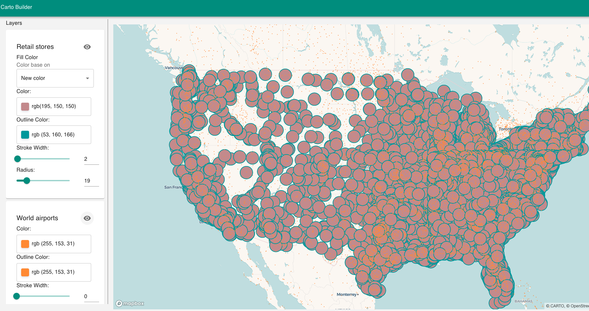
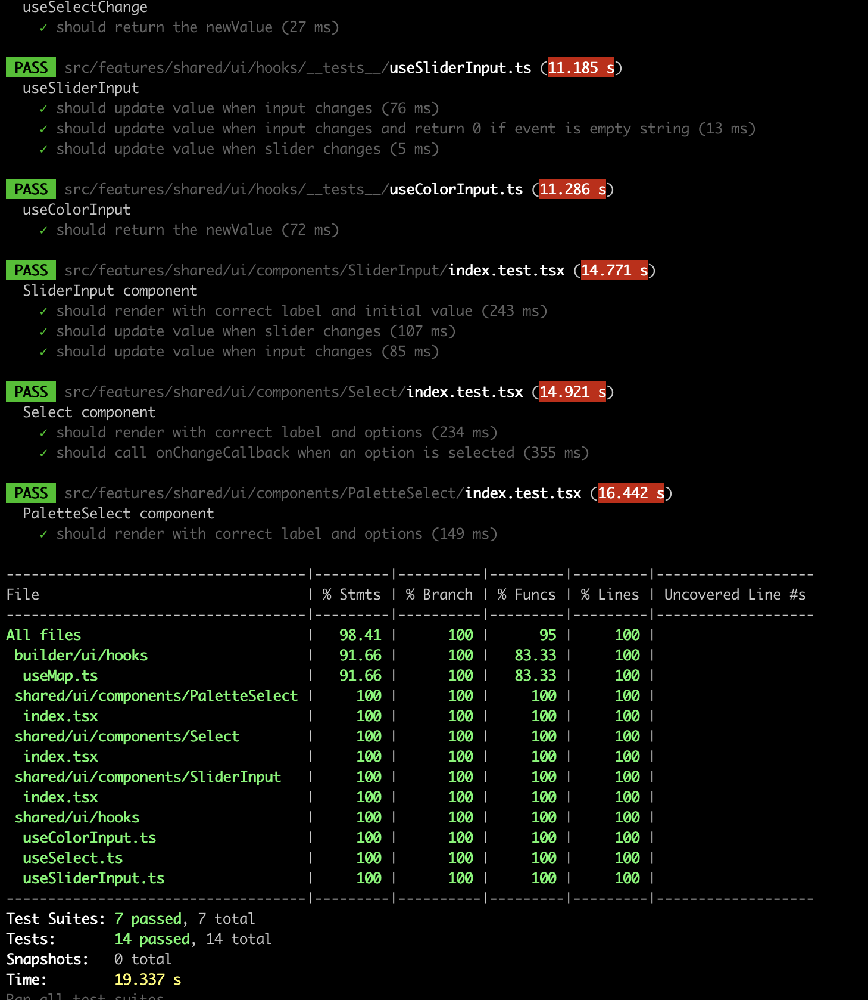

# Carto App

Carto App is an application based on feature flags, in this first version the application only has the Builder functionality and therefore the structure of the project is reflected:

### Project structure
 - app: app will contain and orchestrate the different features
 - features: will contain the different functionalities of the application
    - shared: contains common functionalities that can be shared between the different features such as (hooks, components, models, etc)
    - builder: contains all the logic related to the builder feature as specific components and constants related to this feature

### Next versions and improvements
For the following versions and improvements, more tests could be implemented in the builder feature, improvements in accessibility and more responsive designs since currently the app works correctly in the desktop version. In addition, better documentation and testing of components visually with storybooks

### Deployed on Vercel
https://carto-app.vercel.app/

## Getting Started

1. Create Carto Token to access datasets https://docs.carto.com/carto-for-developers/carto-for-react/guides/authentication-and-authorization.
2. Create Mapbox Access Token https://docs.mapbox.com/help/getting-started/access-tokens/

3. Create `.env` file using `.env.example` and add your tokens into VITE_CARTO_ACCESS_TOKEN and VITE_MAPBOX_ACCESS_TOKEN keys
4. Install dependencies by running: 
```bash
pnpm install
# or
yarn install
# or
npm install
# or
```

4. Run the development server with:

```bash
pnpm dev
# or
yarn dev
# or
npm run dev
```

### Screens:

Initial View (3 layers only Retail Stores visible, palette base on revenue)


2 - View (3 layers only Retail Stores visible, palette base on revenue, radius and stroke modified)


3 - View (3 layers only Retail Stores visible, palette base on revenue, paletter color, radius and stroke modified)


4 - View (3 layers only Retail Stores visible, color, radius and stroke modified)


5 - View (3 layers only Retail Stores and World Airports visibles, color, radius and stroke modified)



## Tests
Unit testing of most features such as hooks and shared components
```bash
pnpm test
# or
yarn test
# or
npm run test
```
